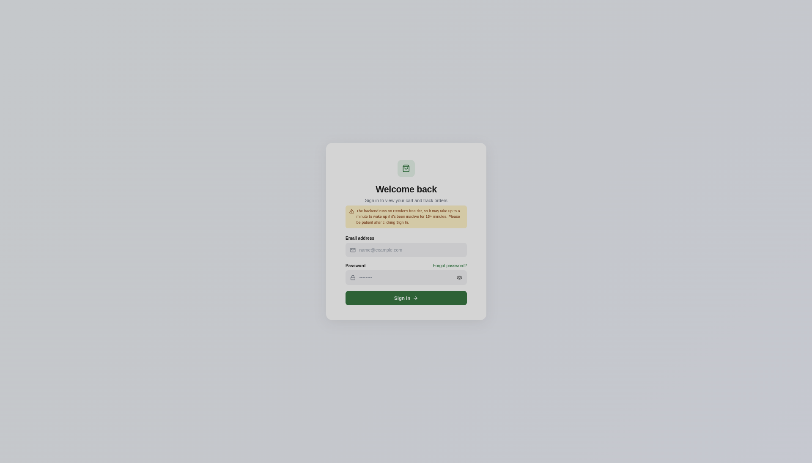
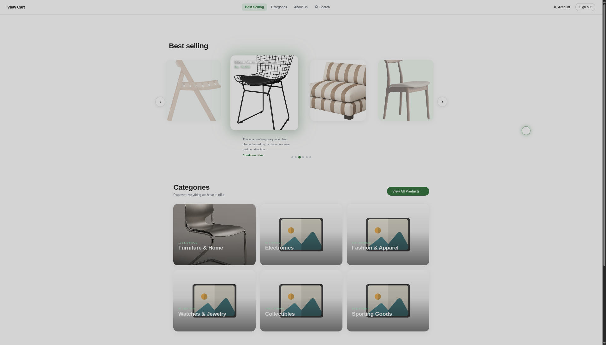
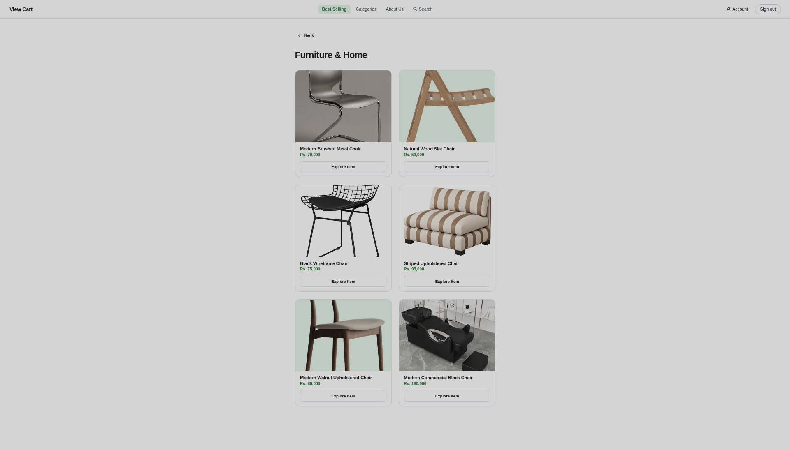
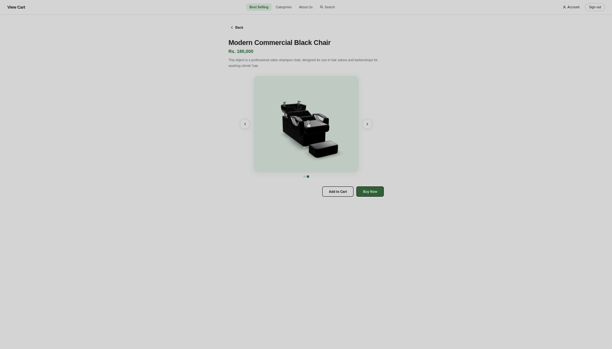

# View Cart

> A proof-of-concept e-commerce platform that adds 3D assets with actual `.glb` 3D scans, allowing buyers to verify the exact physical condition and wear of unique items directly in their browser.

## 📖 Overview

Standard AR e-commerce relies on flawless, mass-produced 3D models. This prototype introduces a novel approach for second-hand and high-value goods: utilizing raw 3D scans. Buyers can rotate, zoom, and inspect the specific physical wear, texture, and quality of the exact unit they are purchasing. 

The application features a strictly minimalist user interface to ensure the 3D assets remain the absolute focal point without visual clutter.

## 🏗 Architecture & Tech Stack

This project is decoupled into a separate client and API to ensure database credentials and storage keys remain completely secure.

*   **Frontend:** React (Hosted on Vercel)
*   **Backend:** Node.js/Express (Hosted on Render)
*   **Database:** MongoDB Atlas (For product metadata)
*   **Asset Storage:** Cloudinary (For dynamic compression and CDN delivery of heavy 3D assets)

### Technical Decisions
*   **Targeted 3D Viewing:** Instead of relying on a complex WebXR and AR.js combination for this prototype, the frontend uses a specific, lightweight implementation tailored directly for rendering `.glb` files. This guarantees cross-browser compatibility and smooth performance on mobile viewports out of the box.
*   **Serverless/PaaS Deployment:** Vercel provides an edge CDN for the static React build, while Render acts as a secure gateway proxy to MongoDB and Cloudinary. 
*   *Note: Due to Render's free tier, the initial API request may take up to 60 seconds to resolve from a cold start.*

## 🚀 Live Demo

*   **Frontend URL:**
```bash
https://view-cart-git-main-lynx7843.vercel.app/login
```

## ⚙️ Local Development Setup

To run this prototype locally, you will need Node.js installed.

### 1. Clone the repository
```bash
git clone https://github.com/lynx7843/View-cart.git
```
### 2. Environment Variables
You will need to create a .env file in your backend directory with the following keys. (Note: Never commit this file to version control).

```bash
PORT=5000
MONGODB_URI=your_mongodb_connection_string
CLOUDINARY_API_KEY=your_key
CLOUDINARY_API_SECRET=your_secret
```

### 3. Start the back-end
```bash
cd server
npm install
npm run dev
```

### 3. Start the front-end
```bash
cd client
npm install
npm run dev
```

## Future Roadmap
- WebXR Integration: Reintroduce spatial AR anchoring using native WebXR APIs so users can place the inspected item directly into their physical space.

- Seller Dashboard: Build an automated pipeline for sellers to upload raw 3D scan files, which are then compressed and pushed directly to Cloudinary.

- Authentication: Implement secure user sessions and a checkout flow (omitted in this version to provide frictionless access for reviewers).

## Preview

|  |  |
| :---: | :---: |
| **Sign In** | **Home** |
|  |  |
| **Category Explorer** | **Item Explorer** |
